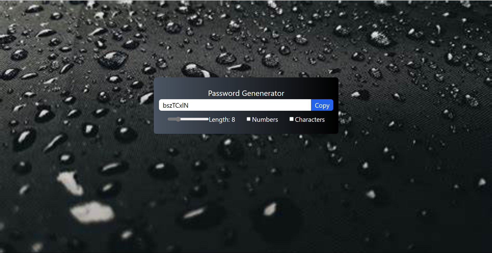

# Random Password Generator

A Vite-powered application for generating secure random passwords with customizable options such as length, inclusion of special characters, and numbers.

[Live Demo](https://password-generator-vite-app.netlify.app/)

---

## Overview
This project allows users to:
- Generate random passwords with adjustable length.
- Include or exclude special characters and numbers.
- Easily copy the generated password for quick use.

---

## Features
- **Customizable Options:** Choose password length and inclusion of special characters and numbers.
- **Responsive Design:** Works seamlessly across all devices.
- **User-Friendly Interface:** Simple and intuitive design for easy interaction.

---

## Technologies Used

### Frontend
- **Vite:** Fast build tool for modern web development.
- **React:** Component-based architecture.
- **CSS3:** Styling and responsive design.

### Hosting
- Hosted on Netlify: [Live Demo](https://password-generator-vite-app.netlify.app/)

---

## Installation

### Steps
1. Clone the repository:
   ```bash
   git clone https://github.com/your-username/password-generator.git
   ```

2. Navigate to the project directory:
   ```bash
   cd password-generator
   ```

3. Install dependencies:
   ```bash
   npm install
   ```

4. Start the development server:
   ```bash
   npm run dev
   ```

---

## How It Works
1. **Custom Input Options:** Users can specify length, and toggle special characters and numbers.
2. **Password Generation:** Generates secure random passwords based on user preferences.
3. **Copy Functionality:** Allows quick copying of generated passwords.

---

## Preview


---

## Future Improvements
- Add more customization options such as uppercase-only or lowercase-only passwords.
- Implement password strength indicators.
- Provide dark/light mode toggle.

---

## Contribution
Contributions are welcome! Feel free to fork the repository and submit a pull request.

---

## Contact
For queries or feedback, please contact [Shubham](mailto:shubhamjaishu@gmail.com).
